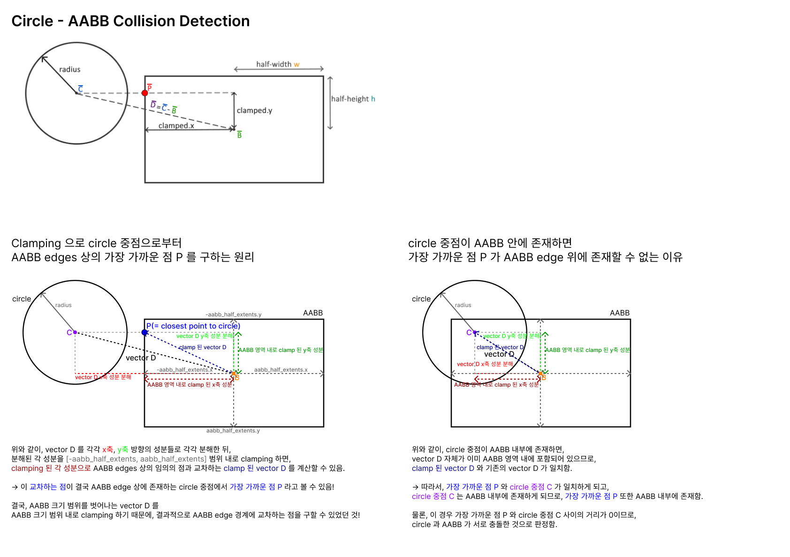

# Project Notes

This document serves as a collection of notes aimed at enhancing the understanding of the project's source code. Key concepts are visualized through diagrams and images for better comprehension.

---

## AABB - Circle Collision Detection

> A visual explanation of the mathematical principles and computation process behind AABB - Circle collision detection.

---
